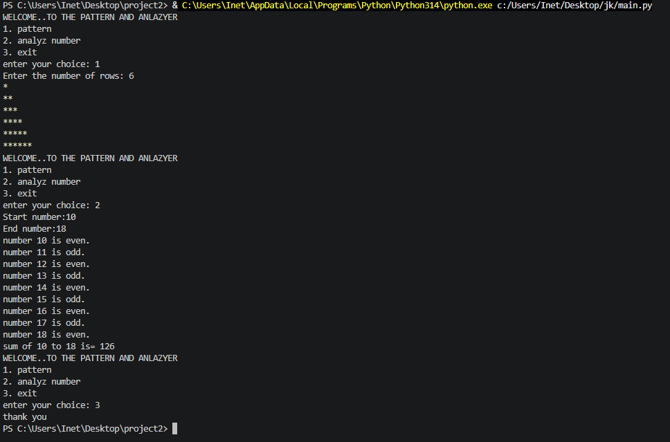

# Python Number Program

## Project Summary

This is a simple Python menu-driven program. It allows the user to print a star pattern, analyze numbers as even or odd, and calculate the sum of numbers in a given range.


## OUTPUT IMAGE



## Features

* Print star pattern
* Check even and odd numbers
* Calculate the sum of numbers
* Menu-driven program
* Exit option

## Technology Used

* Python 
* `while` loop
* `for` loop
* `if-elif-else`
* User input

## How to Run

1. Install Python.
2. Save the program as `main.py`.
3. Open the terminal.
4. Run:

```bash
python main.py
```

## Project Structure

```text
|main.py
|output.png
|README.md
```

## Objective

The objective of this project is to understand basic Python concepts such as loops, conditions, user input, and arithmetic operations.

## Conclusion

This project provides a simple way to practice basic Python programming concepts and understand how a menu-driven program works.

## AUTHOR

**VATSAL SOLANKI**
